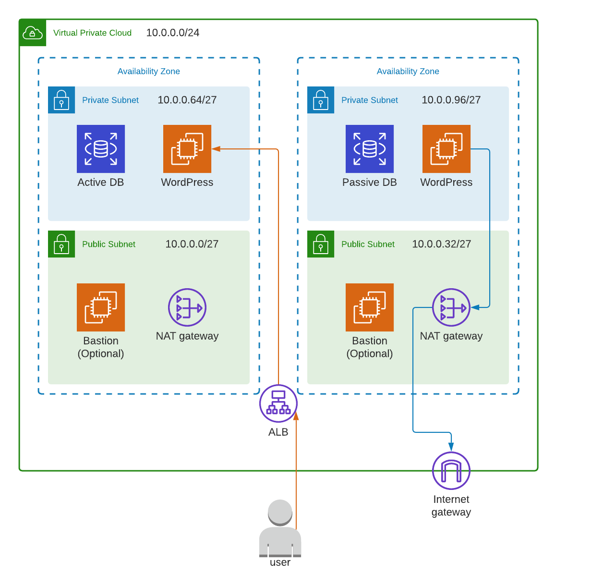
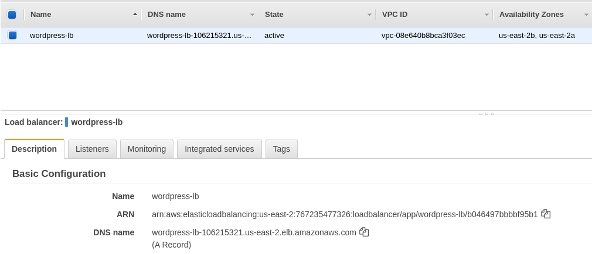
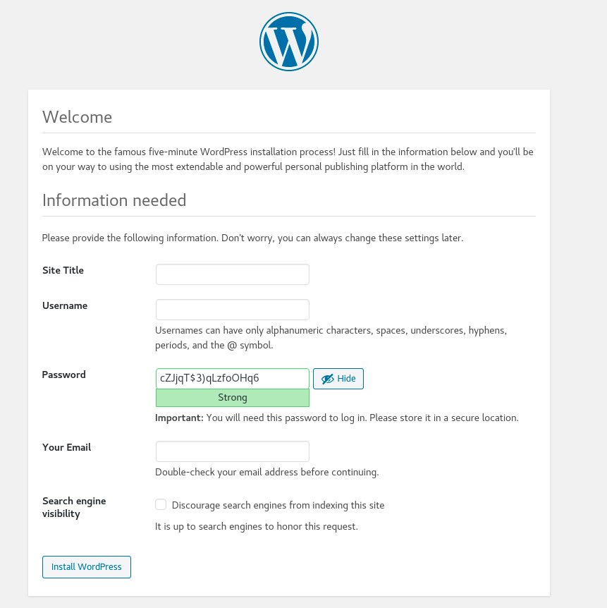

# WordPress In AWS
This project builds and deploys a CentOS AMI with WordPress pre-installed.

## Building the CentOS AMI (optional)
I have already published `ami-0f812b388b19d2a4a` in `us-east-2`, so feel free to skip this section. Note that the ami id is already configured in [terraform.tfvars.example](./terraform.tfvars.example), which I will refer to later on during the deployment.

### Create a Default VPC
My [Packer Template](./packer/template.json) assumes that you have a default VPC in your account.

Run the following command to create a default VPC if you don't already have one:
```bash
aws ec2 create-default-vpc
```

### Run `packer build`
Run the following commands to build the CentOS WordPress AMI. Be sure to replace `${AWS_ACCESS_KEY}` and `${AWS_SECRET_KEY}` with your account credentials.
```bash
cd packer
packer build -var "aws_access_key=${AWS_ACCESS_KEY}" -var "aws_secret_key=${AWS_SECRET_KEY}" template.json
```

## Deploying the CentOS WordPress AMI
I created a [terraform config](./terraform) for deploying this AMI in a highly-available pattern. Below describes an example architecture if you choose to deploy WordPress in private subnets:



### Configuring Variables
The Terraform config takes the following variables:

| Name | Description | Required? |
| ---- | ----------- | --------- |
| availability_zones | A list of AZs to provision subnets to | Yes |
| wordpress_ami | Name of wordpress AMI | Yes |
| db_name | The name of the database | Yes |
| db_username | The db username | Yes |
| db_password | The db password | Yes |
| deploy_bastion | Determines if bastion(s) should be deployed | Yes |
| deploy_wp_to_private_subnet | Determines if WordPress should be deployed to a private subnet behind a NAT gateway | Yes |
| key_pair | The (pre-created) ec2 key pair to use for SSH into bastion and wordpress instances. | No |

Defaults for each required variable are provided in [terraform.tfvars.example](./terraform.tfvars.example). I will use this examples vars file for the installation.

### Run `terraform apply`
Run `terraform apply` to provision the WordPress infrastructure:

```bash
cd terraform
terraform apply -var-file terraform.tfvars.example
```

### Accessing WordPress
Once the deployment is complete, find the DNS name of the `wordpress-lb` load balancer. You can find this in the ec2 console under `Load Balancers`. Here's an example:



In the example above, the DNS name is `wordpress-lb-106215321.us-east-2.elb.amazonaws.com`. The WordPress assets are located at `/wordpress`, so enter the following URL in your browser:

```
$LB_DNS_NAME/wordpress
```

Where `$LB_DNS_NAME` is the DNS name of your load balancer.

If the deployment was successful, you'll see the following screen:



## TODO
While I think this is a great start, I would not recommend this config as-is for production. The following items (at a minimum) need addressed before I could recommend this:

* Need to configure TLS
* Need to create an ASG for the wordpress instances
* Need to provision EFS for files wordpress saves locally, such as plugins and themes
* Need to change the wordpress location on apache to root, so that users don't need to append /wordpress
* Need to configure Route53 so that users don't need to get the LB DNS and can refer to a more natural name
* Need to configure a Parameter or Secrets store as an alternative to passing the DB password in as user data